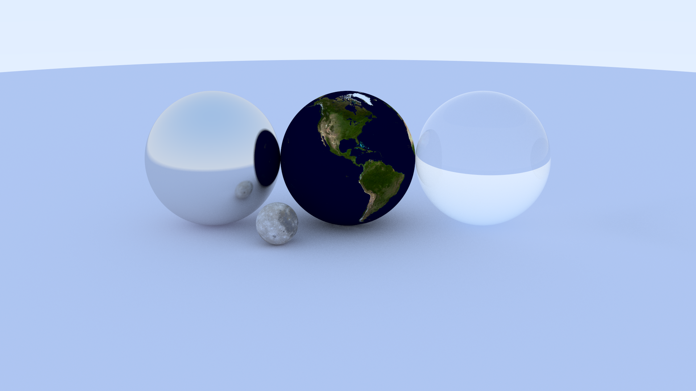
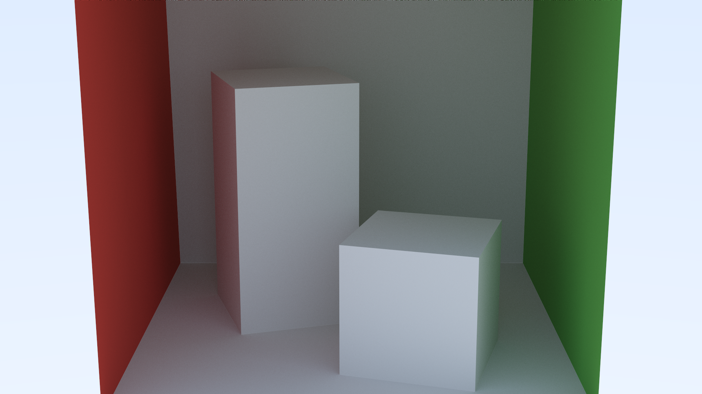

# Compute based Path Tracer
 <br />
 <br />
 <br />
A path tracer implemented using Vulkan compute shaders, inspired by the "Ray Tracing in One Weekend" book but accelerated through GPU parallelization. This project demonstrates the power of modern graphics APIs for general purpose computing tasks.
The implementation efficiently translates the recursive CPU-based algorithms from the Ray Tracing in One Weekend book to the massively parallel architecture of modern GPUs, achieving orders of magnitude performance improvement over traditional CPU implementations while maintaining physically accurate rendering results. <br />
## Prerequisites
- Vulkan SDK 1.3.296.0 or later
- Windows OS
## How to run the application on windows 
To generate cmake files: <br />
```
mkdir build
cd build
cmake ..
```
To build the executable: <br />
`cmake --build .` <br />
or <br />
`cmake --build . --config Release` <br />
## Command line arguments
### Arguments

- **`<scene_path>`**  
  Path to the scene file to render.  
  This argument is required.

### Options

- **`-o <output_image_name>`**  
  Specifies the output image filename.  
  If not provided, a default name will be used.

- **`-gpu`**  
  Use the GPU-based renderer.

- **`-cpu`**  
  Use the CPU-based renderer.

> Exactly one of `-gpu` or `-cpu` should be specified.

### Examples

Render a scene using the GPU and specify an output image:
```bash
renderer scenes/TestScene.json -gpu -o dragon.png
```

## Scene Structure

A scene is defined using a JSON file with two main sections:

- **`camera`**: Defines the view and rendering parameters (position, orientation, resolution, sampling, and depth of field).
- **`models`**: An array of mesh instances, each with its own transform and model file.

### Camera
The `camera` object specifies:
- Position and orientation (`center`, `lookat`, `vup`)
- Projection parameters (`vfov_deg`, `aspect_ratio`)
- Image settings (`screen_width`, `samples_per_pixel`, `max_depth`)
- Depth of field controls (`defocus_angle`, `focus_dist`)

### Models
Each entry in the `models` array represents a single model instance and includes:
- `model_path`: Path to the mesh file (Only `.obj` supported)
- `translation`: World-space position
- `rotation`: Axis-angle rotation `(x, y, z, angle_degrees)`
- `scale`: Uniform scale factor

