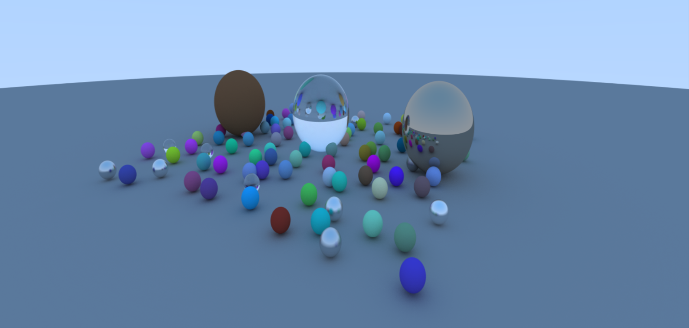

# Compute based Path Tracer
 <br />
A path tracer implemented using Vulkan compute shaders, inspired by the "Ray Tracing in One Weekend" book but accelerated through GPU parallelization. This project demonstrates the power of modern graphics APIs for general purpose computing tasks.
The implementation efficiently translates the recursive CPU-based algorithms from the Ray Tracing in One Weekend book to the massively parallel architecture of modern GPUs, achieving orders of magnitude performance improvement over traditional CPU implementations while maintaining physically accurate rendering results. <br />
## Prerequisites
- Vulkan SDK 1.3.296.0 or later
- Windows OS
## How to run the application on windows 
To generate cmake files: <br />
```
mkdir build
cd build
cmake ..
```
To build the executable: <br />
`cmake --build .` <br />
or <br />
`cmake --build . --config Release` <br />
